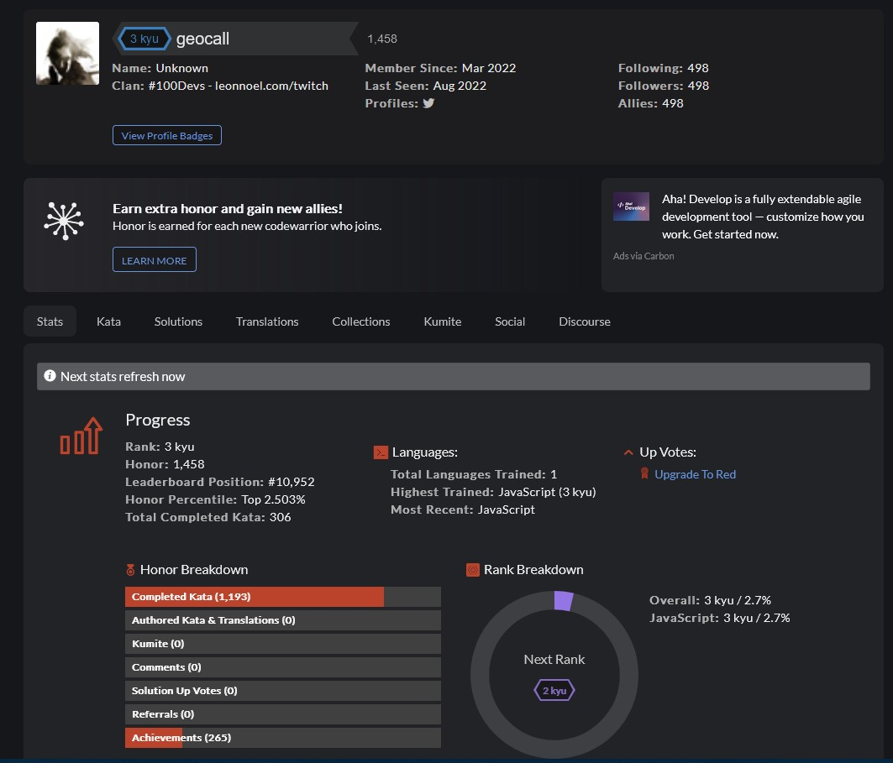

# CodeWar Challenges

**Check my Profile out here!:** https://www.codewars.com/users/geocall

## How It's Made:

**Tech used:** HTML, CSS, JavaScript, Framework of choice

A repo of all my codewars challenges I've completed. So far I have completed 256 and am in the top 3% on the global ladder.
I am currently 3 Kyu(ranking)

## Lessons Learned:

Persistence is key. Its easy to find a weirdly worded challenge or one just out of your wheel house. Moving on and coming back a different time is not something that should be discouraging. 

